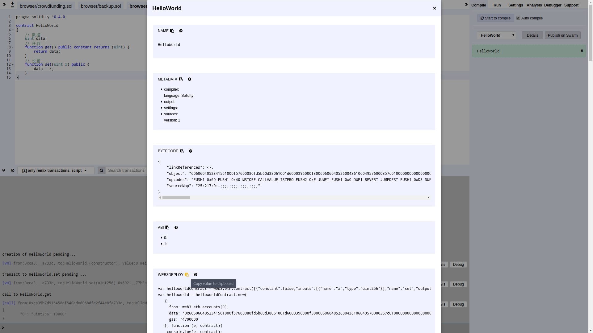
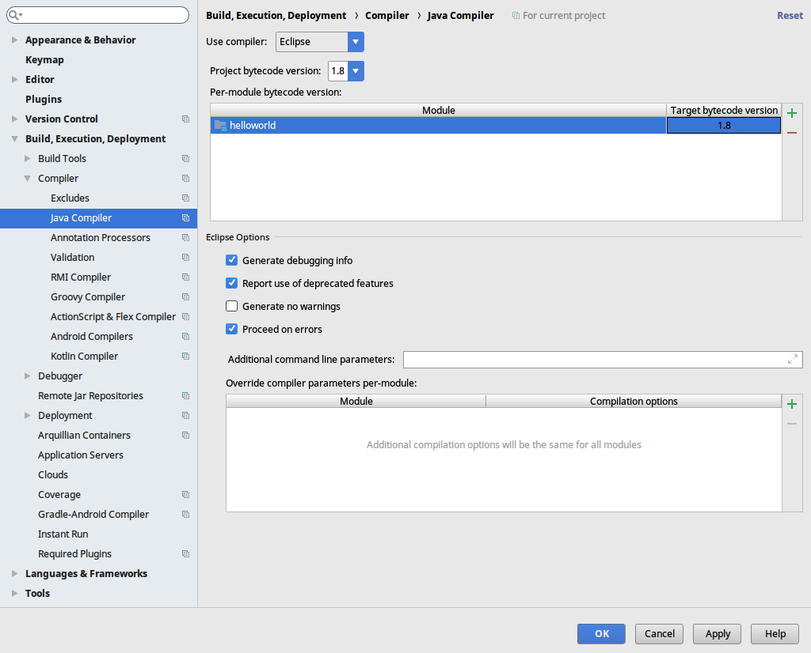

# 以太坊开发

## 安装以太坊
1. 通过 ppa 安装(推荐)
```
$ sudo apt-get install software-properties-common
$ sudo add-apt-repository -y ppa:ethereum/ethereum
$ sudo apt-get update
$ sudo apt-get install ethereum
```
`error1` - gpg: no valid OpenPGP data found:  
```
# 找不到有效的公钥
$ sudo apt-key adv --keyserver keyserver.ubuntu.com --recv-keys XXXXXXXXXXXXXXXX(填入错误提示中的key: 1C52189C923F6CA9)
```
`error2` - E: 无法下载 http://cn.archive.ubuntu.com/ubuntu/pool/universe/s/swarm-cluster/swarm_2.1.8-2_amd64.deb  404  Not Found [IP: 2001:67c:1562::16 80]
```
# 找不到有效的镜像
$ sudo vim /etc/apt/sources.list
添加两行
deb http://ppa.launchpad.net/ethereum/ethereum/ubuntu artful main
deb-src http://ppa.launchpad.net/ethereum/ethereum/ubuntu artful main
```

2. 通过 source 安装
```
$ git clone https://github.com/ethereum/go-ethereum
$ sudo apt-get install -y build-essential golang
$ cd go-ethereum
$ make geth
$ ln -s build/bin/geth /usr/bin/geth # 软链接
```

3. 更多安装方式请看
```
https://github.com/ethereum/go-ethereum/wiki/Building-Ethereum
```

## 初始以太坊
```
# 创建工作目录
$ mkdir ethereum
# 复制创世文件
$ cp genesis.json ethereum
# 初始化以太坊
$ cd ethereum
$ geth init genesis.json
自动生成 ~/.ethereum
.
├── geth
│   ├── chaindata
│   │   ├── 000001.log
│   │   ├── CURRENT
│   │   ├── LOCK
│   │   ├── LOG
│   │   └── MANIFEST-000000
│   └── lightchaindata
│       ├── 000001.log
│       ├── CURRENT
│       ├── LOCK
│       ├── LOG
│       └── MANIFEST-000000
├── history
└── keystore
```

## 启动以太坊
```
# 复制启动脚本
$ cp startup.sh ethereum
# 执行启动脚本
$ ./startup.sh
help:
geth --rpc --rpcapi personal,db,eth,net,web3 --networkid 666666 console
--rpc Enable the HTTP-RPC server
--rpcapi API's offered over the HTTP-RPC interface
--networkid 区块链ID-私链
--console 命令行模式
```

## 钱包
1. 方式一 - 命令行创建钱包
```
# 进入 geth
$ ./startup.sh
# 查询用户
> eth.accounts
# 创建用户
> personal.newAccount("enter your password")
# 查询余额
> eth.getBalance(eth.accounts[0])
```

2. 方式二 - 图形化创建钱包 (下载地址 https://github.com/ethereum/mist/releases/)
```
# 手动安装
$ sudo dpkg -i Ethereum-Wallet-linux64-0-9-3.deb
```


## 挖矿
```
# 进入 geth
$ ./startup.sh
# 开始挖矿 (一个线程挖矿，多线程会很卡)
> miner.start(1)
# 停止挖矿
> miner.stop()
```

## 部署智能合约
1. 方式一 - 通过 wallet

复制 HelloWorld.sol 代码, 选择 "Select Contract to Deploy" 中的 HelloWorld, 点击 DEPLOY 按钮

查看 Contracts 信息


2. 方式二 - 通过 geth

在线测试 https://remix.ethereum.org/

编译合约 Compile -> Details -> WEB3DEPLOY

```
# 进入 geth
$ ./startup.sh
# 解锁用户
> personal.unlockAccount(eth.account[0])
# 输入代码 (复制 WEB3DEPLOY)
> var helloworldContract = web3.eth.contract(......);
var helloworld = helloworldContract.new(......)
控制台输出: INFO [MM-dd|HH:mm:ss] Submitted contract creation              fullhash=0x...... contract=0x......
```

3. 方式三 - 通过 web3j
```
// 参考 CrowdFundingContract.java
public static RemoteCall<HelloWorldContract> deploy(Web3j web3j, Credentials credentials, BigInteger gasPrice, BigInteger gasLimit) {
    // 构造函数参数 NULL
    String encodedConstructor = FunctionEncoder.encodeConstructor(Arrays.<Type>asList());
    return deployRemoteCall(HelloWorldContract.class, web3j, credentials, gasPrice, gasLimit, BINARY, encodedConstructor);
}
// 参考 CrowdFundingMain.java
System.out.println("[ContractAddress] " + contract.getContractAddress());
```

4. 记得挖矿

> 参考链接
  1. 中文文档 http://www.tryblockchain.org/
  2. 英文文档 https://solidity.readthedocs.io/
  3. 在线测试 https://remix.ethereum.org/

## Web3j 轻量级的以太坊开发库 for Java
1. 项目依赖
```
<dependencies>
	<dependency>
		<groupId>org.web3j</groupId>
		<artifactId>core</artifactId>
		<version>3.2.0</version>
	</dependency>
	<dependency>
		<groupId>org.slf4j</groupId>
		<artifactId>slf4j-log4j12</artifactId>
		<version>1.7.25</version>
	</dependency>
</dependencies>
```

2. 项目结构
```
note:
src/main/resources/config.properties 配置文件
help:
--com.redhat.helloworld.util 工具包
----Consts.java 常量类
--com.redhat.helloworld.test 简单测试
----ClientVersionTest.java 客户端版本
----GenerateWalletTest.java 生成钱包
----TransferEthTest.java 转账
----TransactionGetTest.java Web3j 原生调用HelloWorld 合约的 get 方法
----TransactionSetTest.java Web3j 原生调用HelloWorld 合约的 set 方法
----FilterTest.java 过滤器
--com.redhat.helloworld.contract 通用框架
----HelloWorldInterface.java HelloWorld 合约接口
----HelloWorldContract.java HelloWorld 合约实现 !!!继承 Web3j 提供的 Contract 类!!!
----HelloWorldMain.java HelloWorld 合约测试
```

## 最佳实践
继承 Web3j 提供的 Contract 类，里面封装了许多函数:
```
// 请求返回值为单个的函数
protected <T extends Type> RemoteCall<T> executeRemoteCallSingleValueReturn(Function function) {
	return new RemoteCall<>(() -> executeCallSingleValueReturn(function));
}
// 请求返回值为多个的函数
protected RemoteCall<List<Type>> executeRemoteCallMultipleValueReturn(Function function) {
	return new RemoteCall<>(() -> executeCallMultipleValueReturn(function));
}
// 请求执行事务的函数
protected RemoteCall<TransactionReceipt> executeRemoteCallTransaction(Function function) {
	return new RemoteCall<>(() -> executeTransaction(function));
}
用法请看com.redhat.helloworld.contract.HelloWorldContract.java:
public class HelloWorldContract extends Contract implements HelloWorldInterface {
......
}
```
> 参考链接
  1. 官方文档 https://web3j.github.io/web3j/
  2. 官方demo1 https://github.com/web3j/sample-project-gradle
  3. 官方demo2 https://github.com/conor10/web3j-javamag

## 错误信息
1. Usage of API documented as @since 1.8+  
解决方法设置如下:

2. Error:java: Compilation failed: internal java compiler error  
解决方法设置如下:

3. 以上错误可以通过 Maven 设置编译器级别解决
```
<properties>
	<maven.compiler.source>1.8</maven.compiler.source>
	<maven.compiler.target>1.8</maven.compiler.target>
</properties>
```
