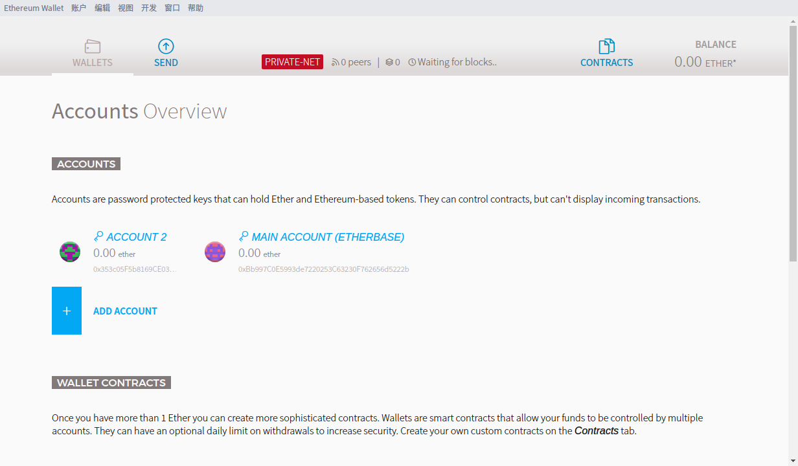
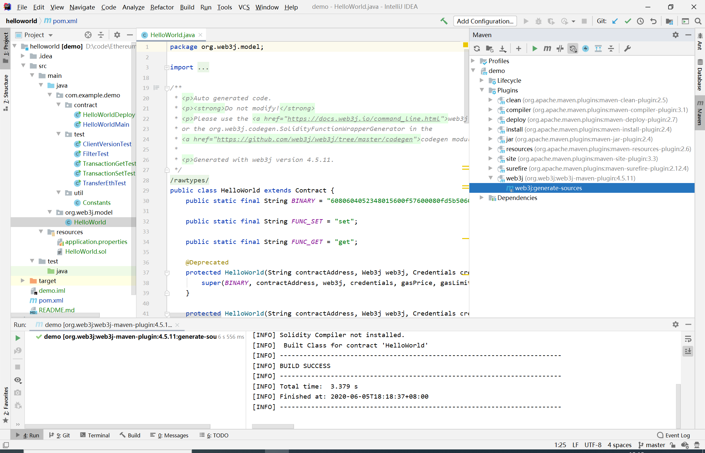
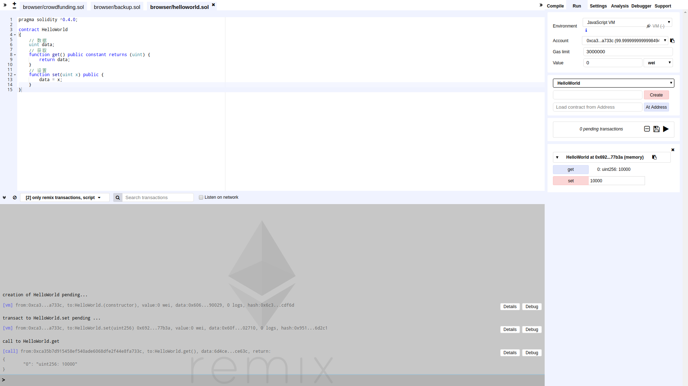

# 以太坊开发 HelloWorld for Java
:smile: 更新版本，支持插件。

## Geth下载
1. 官方下载：
https://ethereum.github.io/go-ethereum/downloads/
2. 国内镜像：
https://ethfans.org/wikis/Ethereum-Geth-Mirror
3. 其他安装方式：
https://github.com/ethereum/go-ethereum/wiki/Building-Ethereum
```
***** CentOS *****
$ yum -y update
$ yum -y install golang
$ git clone https://github.com/ethereum/go-ethereum
$ cd go-ethereum/
$ make geth
$ ls -al build/bin/geth
如果出错，尝试命令：
$ mv /usr/local/include/iconv.h /usr/local/include/iconv.h.back
```

## 初始以太坊
```
$ geth init genesis.json
自动生成 ~/.ethereum
.
├── geth
│   ├── chaindata
│   │   ├── 000001.log
│   │   ├── CURRENT
│   │   ├── LOCK
│   │   ├── LOG
│   │   └── MANIFEST-000000
│   └── lightchaindata
│       ├── 000001.log
│       ├── CURRENT
│       ├── LOCK
│       ├── LOG
│       └── MANIFEST-000000
├── history
└── keystore
```

## 启动以太坊
```
$ startup.bat # Windows
$ startup.sh # Linux

geth --rpc --rpcaddr "0.0.0.0" --rpcport 8545 --rpccorsdomain "*" --rpcapi "personal,db,eth,net,web3" --networkid 666666 console
--rpc Enable the HTTP-RPC server
--rpcaddr HTTP-RPC server listening interface (default: localhost)
--rpcport HTTP-RPC server listening port (default: 8545)
--rpccorsdomain Comma separated list of domains from which to accept cross origin requests (browser enforced)
--rpcapi API's offered over the HTTP-RPC interface (default: eth,net,web3)
--networkid 区块链ID-私链
--console 命令行模式
```

## 钱包
```
# 查询账户
> eth.accounts
# 创建账户
> personal.newAccount("123456") # 密码123456
# 查询余额
> eth.getBalance(eth.accounts[0])
```

## 挖矿
```
# 开始挖矿 (一个线程挖矿，多线程会很卡)
> miner.start(1)
# 停止挖矿
> miner.stop()
```

## 编写合约
1. 中文文档 http://www.tryblockchain.org/
2. 英文文档 https://solidity.readthedocs.io/
3. 在线测试 https://remix.ethereum.org/

## 部署合约
1. 方式一 - remix编译 + geth部署



```
# 解锁用户
> personal.unlockAccount(eth.account[0])
# 输入代码
> var helloworldContract = web3.eth.contract(......); var helloworld = helloworldContract.new(......)

console: INFO [MM-dd|HH:mm:ss] Submitted contract creation              fullhash=0x...... contract=0x......
```

2. 方式二 - web3j ↓

## [Web3j 轻量级的以太坊开发库 for Java](https://web3j.github.io/web3j/)



1. Web3j依赖：https://github.com/web3j/web3j/
```
<dependencies>
	<dependency>
		<groupId>org.web3j</groupId>
		<artifactId>core</artifactId>
		<version>3.2.0</version>
	</dependency>
</dependencies>
```

2. Web3j插件：https://github.com/web3j/web3j-maven-plugin
```
<plugin>
    <groupId>org.web3j</groupId>
    <artifactId>web3j-maven-plugin</artifactId>
    <version>4.5.11</version>
    <configuration>
        <soliditySourceFiles/>
    </configuration>
</plugin>
```

4. 运行插件：Plugins->web3j:generate-sources
```
resources/HelloWorld.sol ----> org.web3j.model.HelloWorld
```

5. 部署合约：test/java/com/example/demo/HelloWorldDeploy.java
```
HelloWorldDeploy contract = HelloWorldDeploy.deploy(web3j, credentials, new DefaultGasProvider()).send();
System.out.println(contract.getContractAddress());
```

6. 加载合约：test/java/com/example/demo/HelloWorldMain.java
```
HelloWorld contract = HelloWorld.load(Constants.ADDRESS, web3j, credentials, new DefaultGasProvider());
System.out.println("getContractAddress : " + contract.getContractAddress());
```

7. 项目结构
```
--com.example.demo.util
----Constants.java 常量

--com.example.demo.test
----ClientVersionTest.java 版本
----TransferEthTest.java 转账
----TransactionGetTest.java Web3j 原生调用合约的 get 方法
----TransactionSetTest.java Web3j 原生调用合约的 set 方法
----FilterTest.java 过滤器

--com.example.demo.contract
----HelloWorldDeploy.java 部署合约
----HelloWorldMain.java 加载合约
```

## Maven镜像
C:\\Users\\zhang\\.m2\\settings.xml
```
<mirrors>
    <mirror>
        <id>ali-maven</id>
        <name>aliyun maven</name>
        <url>http://maven.aliyun.com/nexus/content/groups/public/</url>
        <mirrorOf>central</mirrorOf>
    </mirror>
    <mirror>
        <id>jboss-maven</id>
        <name>jBoss maven</name>
        <url>http://repository.jboss.org/nexus/content/groups/public</url>
        <mirrorOf>central</mirrorOf>
    </mirror>
</mirrors>
```

## 错误信息
Usage of API documented as @since 1.8+

解决方法设置如下：


Error:java: Compilation failed: internal java compiler error

解决方法设置如下：

